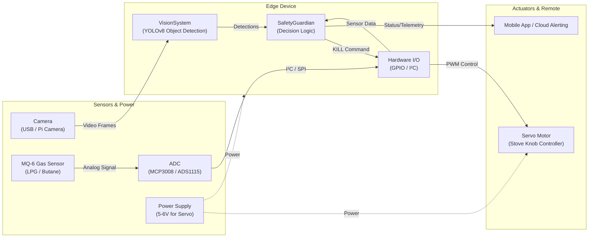
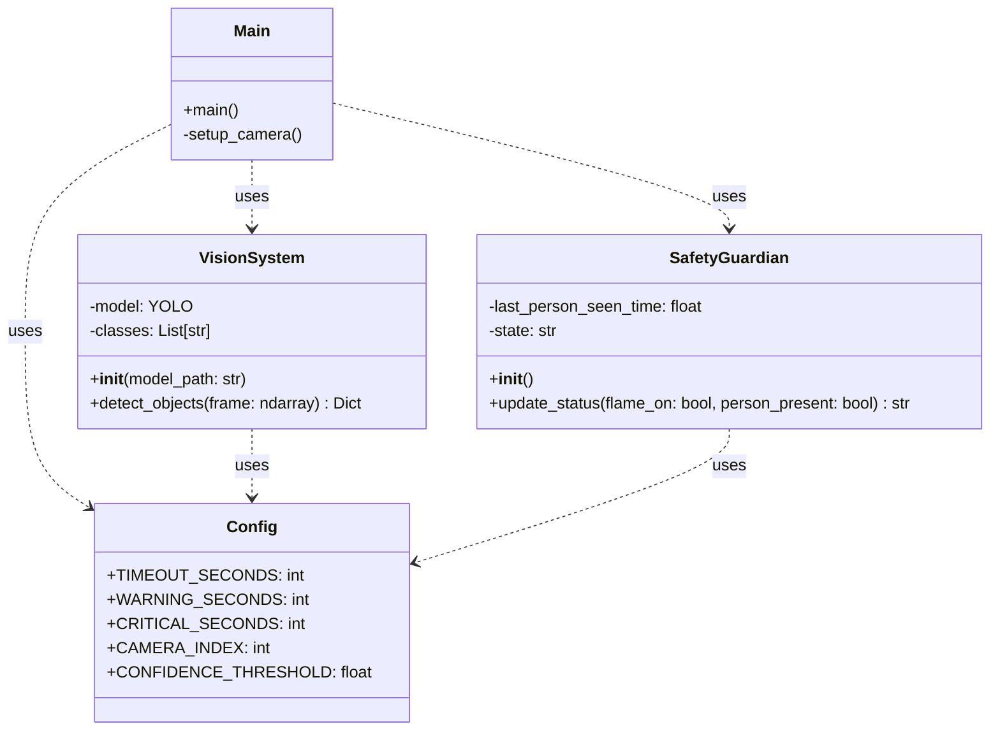
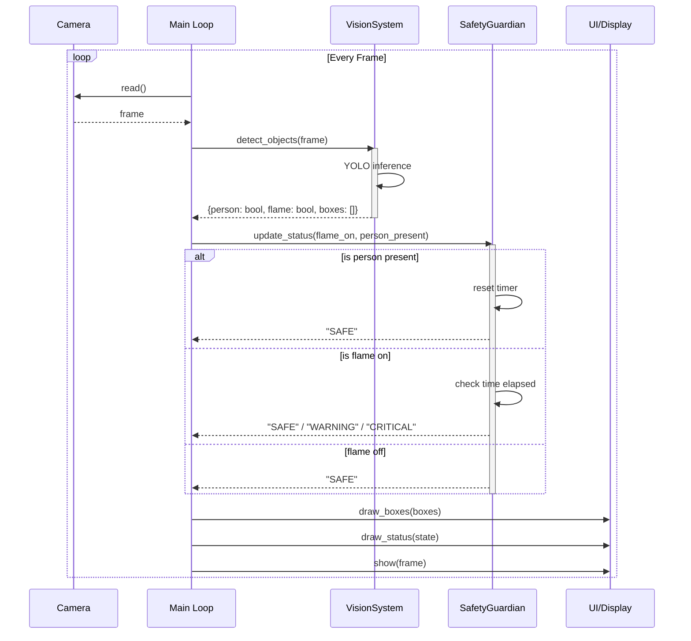

# Kitchen Guardian Architecture

This document describes the hardware and software architecture for the *Kitchen Guardian* IoT project.

## High-Level Architecture (Hardware + Software)

The system is composed of physical sensors, an edge compute device (like a Raspberry Pi), actuators to control the stove, and an alert system. The diagram below illustrates how components are connected and how data flows through the system.

---

## Software Architecture

### Class Diagram

The class diagram shows the structure of the Python application (`main.py`) which acts as the "Brain" on the edge device, unifying the Vision and Safety systems.

### Sequence Diagram

The sequence diagram illustrates the main event loop running on the edge device, checking for humans and flames on every frame, and triggering state changes based on elapsed time.

