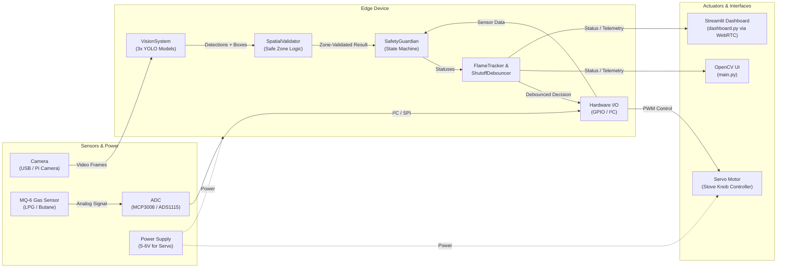
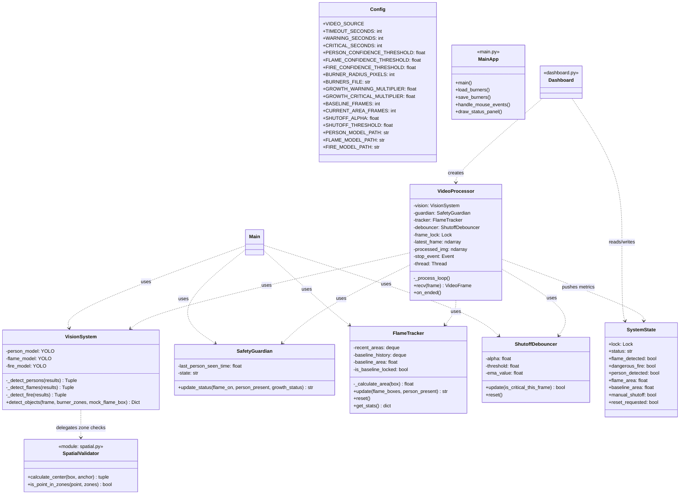
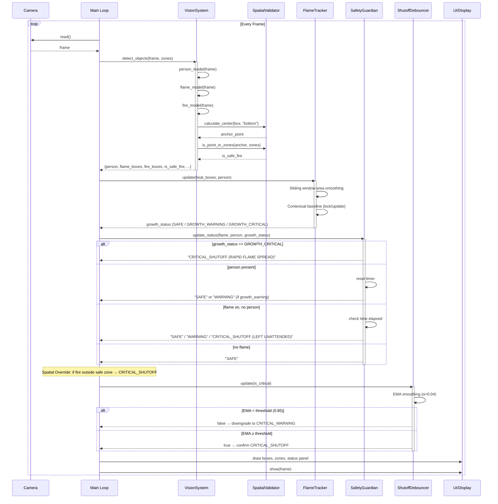
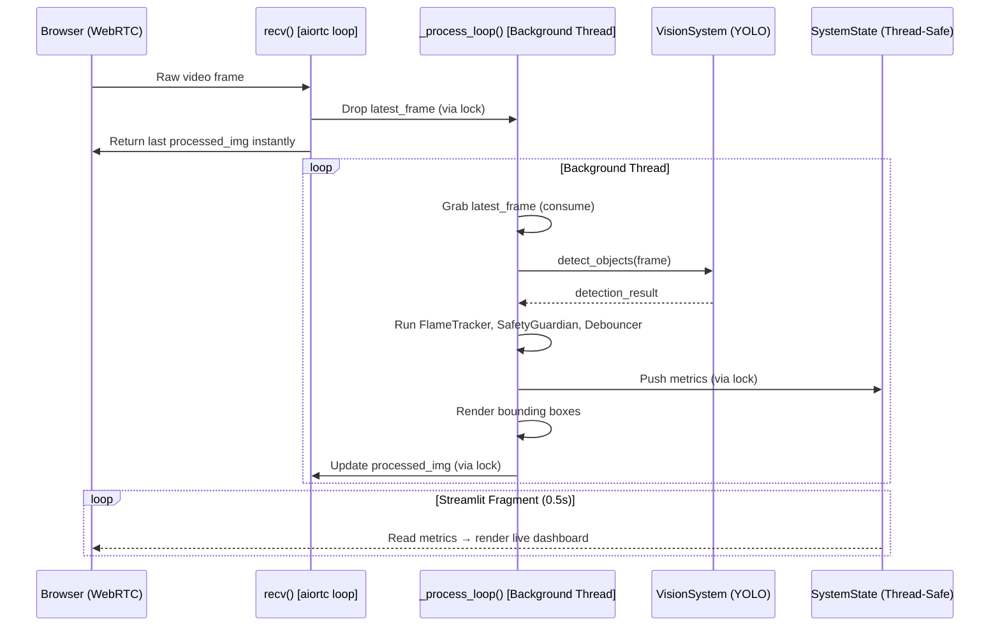

# Kitchen Guardian Architecture

This document describes the hardware and software architecture for the *Kitchen Guardian* IoT project.

## High-Level Architecture (Hardware + Software)

The system is composed of physical sensors, an edge compute device (like a Raspberry Pi), actuators to control the stove, and an alert system. Software runs in two modes: a native OpenCV application (`main.py`) for direct hardware integration, and a Streamlit web dashboard (`dashboard.py`) for remote browser-based monitoring. The diagram below illustrates how components are connected and how data flows through the system.


```mermaid
graph LR
  subgraph Inputs ["Sensors & Power"]
    Camera["Camera<br/>(USB / Pi Camera)"]
    MQ6["MQ-6 Gas Sensor<br/>(LPG / Butane)"]
    ADC["ADC<br/>(MCP3008 / ADS1115)"]
    PSU["Power Supply<br/>(5-6V for Servo)"]
  end
  
  subgraph Edge ["Edge Device"]
    GPIO["Hardware I/O<br/>(GPIO / I²C)"]
    Vision["VisionSystem<br/>(3x YOLO Models)"]
    Spatial["SpatialValidator<br/>(Safe Zone Logic)"]
    Safety["SafetyGuardian<br/>(State Machine)"]
    Temporal["FlameTracker &<br/>ShutoffDebouncer"]
  end
  
  subgraph Outputs ["Actuators & Interfaces"]
    Servo["Servo Motor<br/>(Stove Knob Controller)"]
    CV_UI["OpenCV UI<br/>(main.py)"]
    Dashboard["Streamlit Dashboard<br/>(dashboard.py via WebRTC)"]
  end

  %% Data Flow
  Camera -->|Video Frames| Vision
  MQ6 -->|Analog Signal| ADC
  ADC -->|I²C / SPI| GPIO
  
  Vision -->|Detections + Boxes| Spatial
  Spatial -->|Zone-Validated Result| Safety
  GPIO -->|Sensor Data| Safety
  Safety -->|Statuses| Temporal
  
  Temporal -->|Debounced Decision| GPIO
  GPIO -->|PWM Control| Servo
  
  Temporal -->|Status / Telemetry| CV_UI
  Temporal -->|Status / Telemetry| Dashboard
  
  %% Power Flow
  PSU -.->|Power| Servo
  PSU -.->|Power| Edge
```

---

## Software Architecture

### Project Structure

```
fire-detector-cv/
├── main.py              # Native OpenCV application (local display, calibration UI)
├── dashboard.py         # Streamlit + WebRTC web dashboard (remote monitoring)
├── src/
│   ├── config.py        # All configurable constants and model paths
│   ├── detectors.py     # VisionSystem class (YOLO inference + spatial validation)
│   ├── spatial.py       # Geometric functions for safe zone validation
│   ├── state_machine.py # SafetyGuardian state machine (temporal + growth logic)
│   └── temporal.py      # FlameTracker (growth analysis) + ShutoffDebouncer (EMA)
├── models/
│   ├── stove_fire_best.pt  # Custom YOLO model for stove flame detection
│   └── fire_best.pt        # Custom YOLO model for general fire detection
├── yolov8n.pt           # Pretrained YOLOv8n for person detection
├── docs/
│   └── architecture.md  # This file
└── requirements.txt
```

---

### Class Diagram

The class diagram shows the structure of the Python application. `main.py` provides a native OpenCV frontend with interactive burner calibration, while `dashboard.py` provides a Streamlit web UI with WebRTC streaming supported by an async threading architecture.


```mermaid
classDiagram
    class Config {
        +VIDEO_SOURCE
        +TIMEOUT_SECONDS: int
        +WARNING_SECONDS: int
        +CRITICAL_SECONDS: int
        +PERSON_CONFIDENCE_THRESHOLD: float
        +FLAME_CONFIDENCE_THRESHOLD: float
        +FIRE_CONFIDENCE_THRESHOLD: float
        +BURNER_RADIUS_PIXELS: int
        +BURNERS_FILE: str
        +GROWTH_WARNING_MULTIPLIER: float
        +GROWTH_CRITICAL_MULTIPLIER: float
        +BASELINE_FRAMES: int
        +CURRENT_AREA_FRAMES: int
        +SHUTOFF_ALPHA: float
        +SHUTOFF_THRESHOLD: float
        +PERSON_MODEL_PATH: str
        +FLAME_MODEL_PATH: str
        +FIRE_MODEL_PATH: str
    }

    class VisionSystem {
        -person_model: YOLO
        -flame_model: YOLO
        -fire_model: YOLO
        -_detect_persons(results) Tuple
        -_detect_flames(results) Tuple
        -_detect_fire(results) Tuple
        +detect_objects(frame, burner_zones, mock_flame_box) Dict
    }

    class SpatialValidator {
        <<module: spatial.py>>
        +calculate_center(box, anchor) tuple
        +is_point_in_zones(point, zones) bool
    }

    class SafetyGuardian {
        -last_person_seen_time: float
        -state: str
        +update_status(flame_on, person_present, growth_status) str
    }

    class FlameTracker {
        -recent_areas: deque
        -baseline_history: deque
        -baseline_area: float
        -is_baseline_locked: bool
        -_calculate_area(box) float
        +update(flame_boxes, person_present) str
        +reset()
        +get_stats() dict
    }

    class ShutoffDebouncer {
        -alpha: float
        -threshold: float
        -ema_value: float
        +update(is_critical_this_frame) bool
        +reset()
    }

    class MainApp {
        <<main.py>>
        +main()
        +load_burners()
        +save_burners()
        +handle_mouse_events()
        +draw_status_panel()
    }

    class Dashboard {
        <<dashboard.py>>
    }

    class SystemState {
        +lock: Lock
        +status: str
        +flame_detected: bool
        +dangerous_fire: bool
        +person_detected: bool
        +flame_area: float
        +baseline_area: float
        +manual_shutoff: bool
        +reset_requested: bool
    }

    class VideoProcessor {
        -vision: VisionSystem
        -guardian: SafetyGuardian
        -tracker: FlameTracker
        -debouncer: ShutoffDebouncer
        -frame_lock: Lock
        -latest_frame: ndarray
        -processed_img: ndarray
        -stop_event: Event
        -thread: Thread
        -_process_loop()
        +recv(frame) VideoFrame
        +on_ended()
    }

    Main ..> VisionSystem : uses
    Main ..> SafetyGuardian : uses
    Main ..> FlameTracker : uses
    Main ..> ShutoffDebouncer : uses
    VisionSystem ..> SpatialValidator : delegates zone checks
    Dashboard ..> VideoProcessor : creates
    Dashboard ..> SystemState : reads/writes
    VideoProcessor ..> VisionSystem : uses
    VideoProcessor ..> SafetyGuardian : uses
    VideoProcessor ..> FlameTracker : uses
    VideoProcessor ..> ShutoffDebouncer : uses
    VideoProcessor ..> SystemState : pushes metrics
```

---

### Sequence Diagram

The sequence diagram illustrates the main event loop running on the edge device, showing the multi-model inference pipeline, spatial zone validation, temporal growth tracking, and EMA-based shutoff debouncing.


```mermaid
sequenceDiagram
    participant C as Camera
    participant M as Main Loop
    participant V as VisionSystem
    participant Sp as SpatialValidator
    participant FT as FlameTracker
    participant S as SafetyGuardian
    participant D as ShutoffDebouncer
    participant U as UI/Display

    loop Every Frame
        M->>C: read()
        C-->>M: frame

        M->>V: detect_objects(frame, zones)
        activate V
        V->>V: person_model(frame)
        V->>V: flame_model(frame)
        V->>V: fire_model(frame)
        V->>Sp: calculate_center(box, "bottom")
        Sp-->>V: anchor_point
        V->>Sp: is_point_in_zones(anchor, zones)
        Sp-->>V: is_safe_fire
        V-->>M: {person, flame_boxes, fire_boxes, is_safe_fire, ...}
        deactivate V

        M->>FT: update(heat_boxes, person)
        activate FT
        FT->>FT: Sliding window area smoothing
        FT->>FT: Contextual baseline (lock/update)
        FT-->>M: growth_status (SAFE / GROWTH_WARNING / GROWTH_CRITICAL)
        deactivate FT

        M->>S: update_status(flame, person, growth_status)
        activate S
        alt growth_status == GROWTH_CRITICAL
            S-->>M: "CRITICAL_SHUTOFF (RAPID FLAME SPREAD)"
        else person present
            S->>S: reset timer
            S-->>M: "SAFE" or "WARNING" (if growth_warning)
        else flame on, no person
            S->>S: check time elapsed
            S-->>M: "SAFE" / "WARNING" / "CRITICAL_SHUTOFF (LEFT UNATTENDED)"
        else no flame
            S-->>M: "SAFE"
        end
        deactivate S

        note over M: Spatial Override: if fire outside safe zone → CRITICAL_SHUTOFF

        M->>D: update(is_critical)
        activate D
        D->>D: EMA smoothing (α=0.04)
        alt EMA < threshold (0.85)
            D-->>M: false → downgrade to CRITICAL_WARNING
        else EMA ≥ threshold
            D-->>M: true → confirm CRITICAL_SHUTOFF
        end
        deactivate D

        M->>U: draw boxes, zones, status panel
        M->>U: show(frame)
    end
```

---

### Dashboard Threading Architecture

The Streamlit web dashboard (`dashboard.py`) uses an **async threading** architecture to decouple the WebRTC video pipeline from the computationally expensive YOLO inference.


```mermaid
sequenceDiagram
    participant B as Browser (WebRTC)
    participant R as recv() [aiortc loop]
    participant T as _process_loop() [Background Thread]
    participant Y as VisionSystem (YOLO)
    participant S as SystemState (Thread-Safe)

    B->>R: Raw video frame
    R->>T: Drop latest_frame (via lock)
    R->>B: Return last processed_img instantly

    loop Background Thread
        T->>T: Grab latest_frame (consume)
        T->>Y: detect_objects(frame)
        Y-->>T: detection_result
        T->>T: Run FlameTracker, SafetyGuardian, Debouncer
        T->>S: Push metrics (via lock)
        T->>T: Render bounding boxes
        T->>R: Update processed_img (via lock)
    end

    loop Streamlit Fragment (0.5s)
        S-->>B: Read metrics → render live dashboard
    end
```

- **`recv()`** runs on the aiortc event loop. It only copies the raw frame in and the processed frame out—**zero ML work**.
- **`_process_loop()`** runs on a daemon thread. It consumes the latest frame, runs all YOLO models, applies decision logic, renders boxes, and pushes the result back.
- **`SystemState`** is a thread-safe container that bridges the background thread and Streamlit's `@st.fragment` UI polling loop.